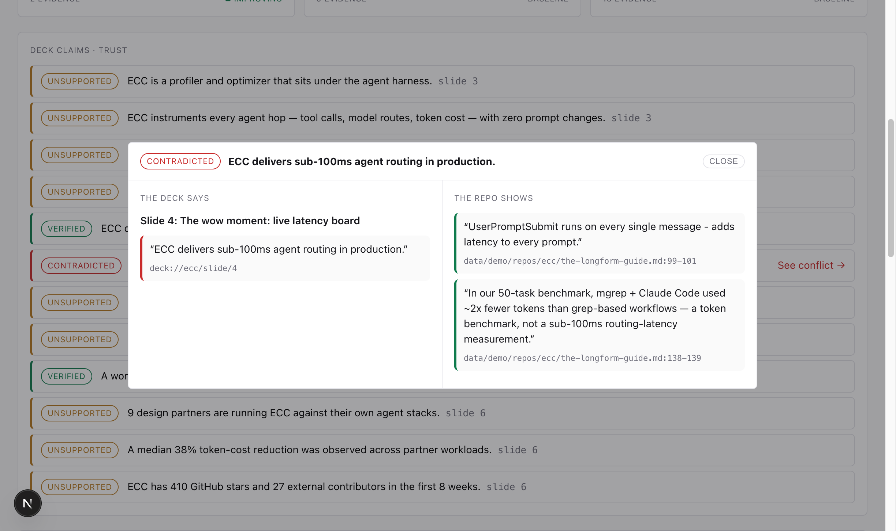
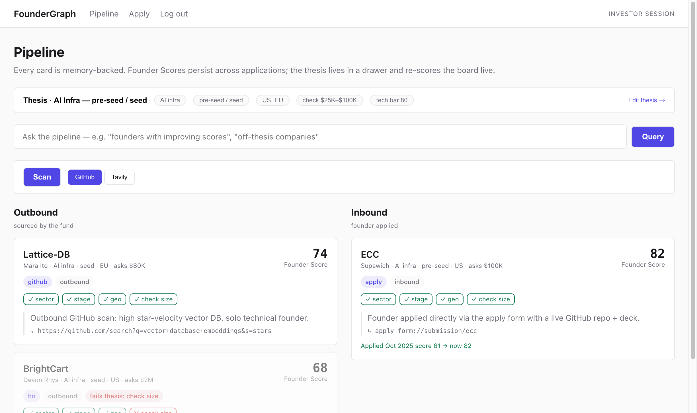
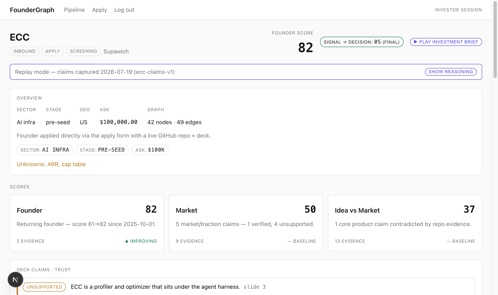
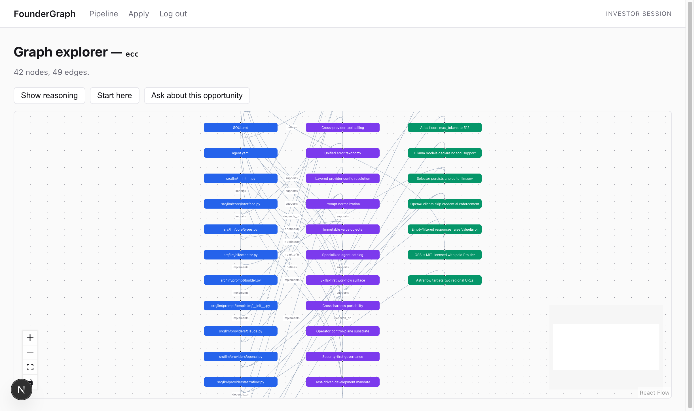

# FounderGraph

**Turns 3 weeks of vibes into 24 hours of evidence.**

FounderGraph is a VC Brain for [Challenge 02 — The VC Brain](Topics/1784381921507-02-Maschmeyer-Group-The-VC-Brain.docx.pdf) (Maschmeyer Group). It sources founders, builds a living technical + claim graph from their repo and deck, scores them on three axes with per-claim Trust Scores, and writes a 24-hour investment memo you can walk back to the exact evidence on screen.

> **Track sentence:** *The VC Brain that deploys $100K checks in 24 hours — sources founders, builds a living technical + claim graph, scores them on three axes with Trust Scores, and writes a 24-hour investment memo.*

**Event:** Hack Nation, 6th Global AI Hackathon · 18–19 July 2026
**Not submitting as:** 01 Negotiator — ElevenLabs is a voice layer on the VC Brain, not the product.
**Product plan:** [VC-BRAIN-PLAN.md](VC-BRAIN-PLAN.md)

---

## What it does

Four surfaces, one golden path from an inbound founder to a signed decision.

| Surface | Route | What the investor does |
|---|---|---|
| **Pipeline** | `/` | Thesis-filtered triage. Inbound and outbound cards carry Founder Score, thesis-fit, and source before any deep read. |
| **Diligence** | `/opportunities/[id]` | Three axes + Founder Score, per-claim Trust Scores, the decision, and the investment brief. |
| **Graph** | `/opportunities/[id]/graph` | The founder's technical knowledge graph. Click a node; ask the grounded chat and watch answers stream with citations. |
| **Apply** | `/apply` | Public founder application that feeds the inbound pipeline. |

**The wow moment:** click a red **CONTRADICTED** claim and the app jumps straight to the exact deck slide and graph node holding the incompatible evidence. Every conclusion cites where it came from, so any score walks back to something you can see.

## Screenshots

| The wow moment — contradiction, deck vs repo | Pipeline |
|---|---|
|  |  |

| Diligence — axes, Trust claims, memo | Graph explorer + tour + grounded chat |
|---|---|
|  |  |

## How it works

- **Single Next.js 16 app** (App Router, React 19, TypeScript). The graph renders with [`@xyflow/react`](https://reactflow.dev); schema validation is [`zod`](https://zod.dev).
- **Persistent Memory** in `better-sqlite3`: a founder's Score carries across sightings, so a second appearance is never a cold start.
- **Two schema-validated LLM calls** run the scored diligence — a claim extractor and an axes/memo writer. Scores come from a deterministic TypeScript rubric, not from a model, so no number is invented. The graph chat is a separate grounded, streaming call.
- **LLM work runs through the Anthropic API** (`@anthropic-ai/sdk`, model `claude-opus-4-8`, one shared client in `src/lib/llm.ts`). Set `ANTHROPIC_API_KEY` to run real inference in production; without it the app serves the captured replays under `data/replay/` (demo mode), so the full walkthrough works with no key.
- **Founder sourcing runs on Tavily.** One real web scan was captured and is replayed deterministically in the demo (see Limitations).

## Setup

**Requires Node 26** (the build uses `better-sqlite3`, which is compiled against Node's native ABI — `NODE_MODULE_VERSION 147`; an older Node will refuse to load it). This was built and tested on Node 26.3.1.

```sh
node -v                      # expect v26.x
npm install
cp .env.example .env.local   # every key is optional — replay and text fallbacks cover the full demo
npm run seed                 # seed the three demo opportunities (repeatable); run before dev
npm run dev                  # http://localhost:3000
npm test                     # node --test suite (62 tests)
```

Investor surfaces sit behind a demo-lite login (credentials = `DEMO_INVESTOR_EMAIL` / `DEMO_INVESTOR_PASSWORD` from `.env.example`, shown on the login screen). The founder `/apply` form is public.

## Limitations

This is a hackathon demo built for one rehearsed path. Read it as such:

- **Auth is demo-lite, not real auth.** The login is a demo-credential gate and the investor API routes are not hardened — do not treat this as a secure deployment.
- **The Tavily founder scan and the repo scan are captured replays,** labeled as such in the app. A real run was made once, saved provenance-style, and replayed so the stage demo can't die on venue Wi-Fi. No live network call happens during the demo by design.
- **The investor voice brief shows a text-script fallback** ("Voice unavailable — script:") — the ElevenLabs voiced version is the planned layer, not what runs in dev.
- **Runs in dev mode** (`npm run dev`) on seeded demo data. Demo data is synthetic but shaped from the real anchor case.

## Attribution

The graph schema *shape* was adapted from [Understand-Anything](https://github.com/Egonex-AI/Understand-Anything) (MIT). No Understand-Anything code is vendored — `src/lib/graph` is original. The diligence engine, three-axis and Founder scoring, Trust Scores, Memory, memo, and decision flow are original to this challenge.

## Repo layout

```
├── README.md                 ← you are here
├── VC-BRAIN-PLAN.md          ← product spec & architecture
├── CLAUDE.md                 ← agent operating rules
├── TODO.md                   ← live status board
├── src/                      ← the Next.js app (surfaces, API routes, lib)
├── scripts/                  ← seed + precompute (claims, memo, chat, scan)
├── data/                     ← seeded demo data + captured Tavily/scan replays
├── tests/                    ← node --test suite
├── Topics/                   ← official challenge briefs (PDFs)
├── HackathonMaterials/       ← official event PDFs / assets
└── docs/
    ├── README.md             ← full document map
    ├── ops/                  ← how we run the weekend (incl. DEMO-SCRIPT.md)
    └── research/             ← event intel & past winners
```

| Need | Go here |
|------|---------|
| Product spec & architecture | [VC-BRAIN-PLAN.md](VC-BRAIN-PLAN.md) |
| Demo walk (3 min) | [docs/ops/DEMO-SCRIPT.md](docs/ops/DEMO-SCRIPT.md) |
| Pitch narrative + judge Q&A | [docs/ops/PITCH.md](docs/ops/PITCH.md) |
| Challenge briefs | [Topics/](Topics/) |
| All docs index | [docs/README.md](docs/README.md) |

## Agent triggers (Claude Code)

Type in chat: `start` · `dryrun` · `retro` — see [CLAUDE.md](CLAUDE.md) and [docs/ops/PROMPTS.md](docs/ops/PROMPTS.md).
