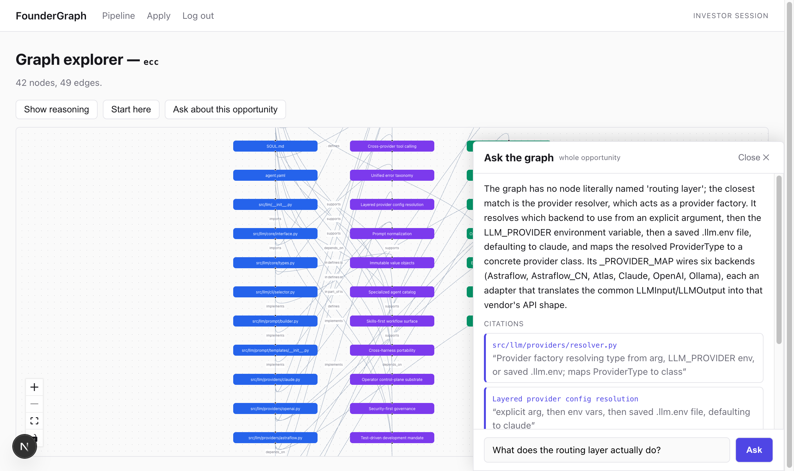
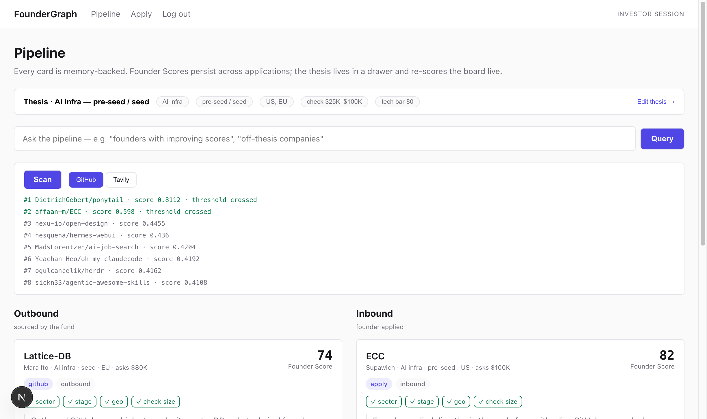
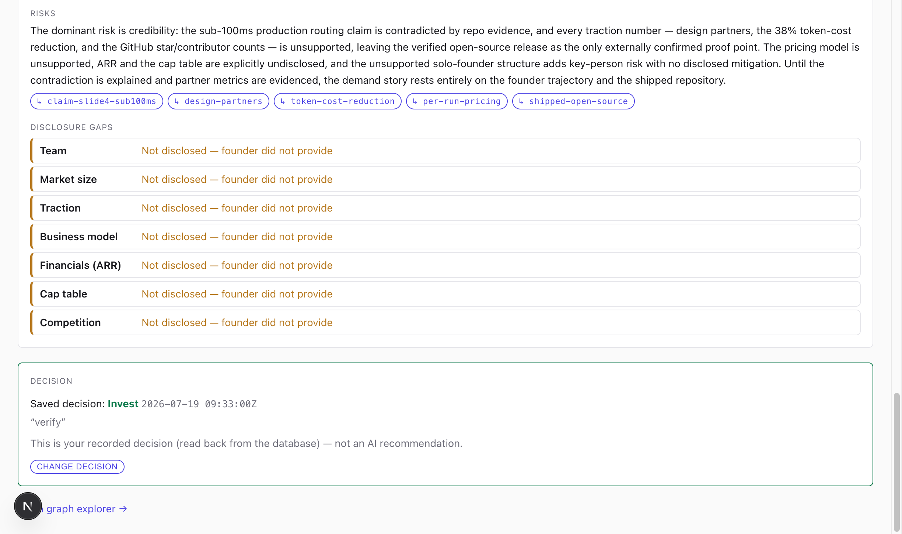

# VIDEO-SHOTLIST.md — shot cards for all three required videos

How to use (per SUBMISSION.md shot-list rules): **record one shot at a time** — a flub redoes
that shot, never the take. Each card shows the REAL screenshot of the target state so you know
exactly what should be on screen before you speak. Straight cuts, no transitions.

App: http://localhost:3941, logged in, freshly seeded (`npm run seed` if in doubt —
PipeWarden must be HIDDEN at the start of the demo video).

---

# 1 · Demo video — max 60 seconds (hard cap)

Narration ~140 words ≈ 58s at 150 wpm. Read the whole script aloud once before recording.

## Continuous narration

> VCs spend **118 hours** of due diligence per deal — and founders without warm intros never
> get looked at. This is FounderGraph. Every card is a founder, scored from evidence, filtered
> by my investment thesis. This one is me — my actual repo. One click: three separate scores —
> founder, market, idea versus market — and every deck claim tested against the code. Verified.
> Unsupported. And this one: contradicted. One more click — the deck says sub-100ms routing;
> the repo says otherwise. Exact slide, exact line. The whole repo is a living knowledge graph.
> I ask a question; the answer streams back with citations. Sourcing runs on Tavily — a real
> captured scan — and when a candidate crosses the threshold, they appear on the board. Three
> axes, a cited 24-hour memo, my decision on top. FounderGraph: $100K checks in 24 hours.

### Shot 1 · 0:00–0:08 · The problem

**ACTION:** none — let the board sit still.
**SAY:** "VCs spend **118 hours** of due diligence per deal — and founders without warm intros never get looked at."

### Shot 2 · 0:08–0:16 · The face (real anchor)

Same screen as Shot 1 — move the cursor to the **ECC card** (bottom, Inbound column, Founder Score 82).

**ACTION:** hover the ECC card; circle the Founder Score + thesis chips with the cursor.
**SAY:** "This is FounderGraph. Every card is a founder, scored from evidence, filtered by my investment thesis. This one is me — my actual repo."

### Shot 3 · 0:16–0:26 · One click into diligence

**ACTION:** click the ECC card. Scroll slowly: three axes → into the claims list.
**SAY:** "One click: three separate scores — founder, market, idea versus market — and every deck claim tested against the code. Verified. Unsupported. And this one: contradicted."

### Shot 4 · 0:26–0:36 · THE WOW — contradiction split view

**ACTION:** click the red **CONTRADICTED** claim. Hold the modal still for 3 beats.
**SAY:** "One more click — the deck says sub-100ms routing; the repo says otherwise. Exact slide, exact line."

### Shot 5 · 0:36–0:45 · Graph + cited chat

**ACTION:** close the modal → "Open graph explorer →" → "Ask about this opportunity" → hit Ask
(question pre-typed BEFORE recording: "What does the routing layer actually do?"). Let the
answer stream and the CITATIONS block land.
**SAY:** "The whole repo is a living knowledge graph. I ask a question; the answer streams back with citations."

### Shot 6 · 0:45–0:53 · Scan reveal (sponsor beat)

**ACTION:** back to Pipeline → click **Tavily** then **Scan** (sourcing ladder runs) → click
**GitHub** then **Scan** — the hidden **PipeWarden** card pops with "threshold crossed".
Order matters: Tavily = sourcing ladder only; the GitHub scan is what reveals PipeWarden.
**SAY:** "Sourcing runs on Tavily — a real captured scan — and when a candidate crosses the threshold, they appear on the board."

### Shot 7 · 0:53–0:60 · Close on the memo + decision

**ACTION:** back to ECC diligence; scroll to the memo gaps + DECISION section. Freeze frame.
**SAY:** "Three axes, a cited 24-hour memo, my decision on top. FounderGraph: $100K checks in 24 hours."

---

# 2 · Tech video — max 60 seconds ("CTO giving a 1-minute investor update")

**Format ruling: screen recording over your real repo/app, NOT PowerPoint.** Judges reward
real code and a live test run; slides hide exactly the thing this video must prove. (Slides
are an acceptable fallback only if recording tooling fails.) Shots 1–2 and 4–6 are just a
file/terminal on screen — the "where to look" is the path given in the card.

Narration ~145 words ≈ 58s.

## Continuous narration

> One Next.js app, TypeScript end to end, SQLite as persistent founder Memory. Exactly two
> schema-validated LLM calls run the diligence — a claim extractor and a memo writer — through
> the local claude CLI. Every score comes from a deterministic TypeScript rubric, so no model
> ever invents a number. The hard part was epistemic honesty: chat that cites or refuses,
> per-claim trust states, and one genuinely contradicted claim grounded in my real repository.
> Everything external is captured once for real — the Tavily sourcing scan, the LLM runs —
> and replayed deterministically with provenance, so the demo can't die on venue Wi-Fi.
> Sixty-two automated tests and a thirteen-beat offline smoke gate the golden path. Honest
> limits: auth is a demo gate, the voice brief ships as a text fallback, and every replay is
> labeled a replay. The rest runs live.

### Shot 1 · 0:00–0:12 · Stack

**Screen:** `README.md` § "How it works" (editor preview or GitHub after the repo is public).
**ACTION:** scroll the bullets slowly.
**SAY:** "One Next.js app, TypeScript end to end, SQLite as persistent founder Memory. Exactly two schema-validated LLM calls run the diligence — a claim extractor and a memo writer — through the local claude CLI."

### Shot 2 · 0:12–0:20 · No invented numbers

**Screen:** `src/lib/scoring.ts` open in your editor, `computeAxisScores` in view.
**ACTION:** move the cursor down the function once.
**SAY:** "Every score comes from a deterministic TypeScript rubric, so no model ever invents a number."

### Shot 3 · 0:20–0:33 · Epistemic honesty

**Screen:** the app — Diligence claims list (http://localhost:3941/opportunities/ecc).
**ACTION:** hover a VERIFIED badge, then the CONTRADICTED one.
**SAY:** "The hard part was epistemic honesty: chat that cites or refuses, per-claim trust states, and one genuinely contradicted claim grounded in my real repository."

### Shot 4 · 0:33–0:45 · Real captures, deterministic replay

**Screen:** Finder/editor at `data/replay/` with `scan/` and a `provenance.json` open
(model, cost, timestamp visible).
**ACTION:** open `data/replay/claims/provenance.json`; point at model + totalCostUsd.
**SAY:** "Everything external is captured once for real — the Tavily sourcing scan, the LLM runs — and replayed deterministically with provenance, so the demo can't die on venue Wi-Fi."

### Shot 5 · 0:45–0:52 · Gates

**Screen:** terminal in the repo.
**ACTION:** run `npm test` live — it finishes in ~4s ending "62 pass, 0 fail".
**SAY:** "Sixty-two automated tests and a thirteen-beat offline smoke gate the golden path."

### Shot 6 · 0:52–0:60 · Honest limits

**Screen:** `README.md` § "Limitations".
**ACTION:** scroll it once; freeze.
**SAY:** "Honest limits: auth is a demo gate, the voice brief ships as a text fallback, and every replay is labeled a replay. The rest runs live."

---

# 3 · Team video — "explain who you are" (no official cap; keep ~30s)

Single talking-head shot, webcam, one take. No screen share.

> Hi, I'm Supawich — a solo technical founder, and the whole team behind FounderGraph.
> I built it in one weekend for Hack-Nation's VC Brain challenge. The founder being
> diligenced in the demo is me: that's my real repository, my real deck claims, and one
> real contradiction the system caught in my own pitch. I'm exactly the kind of founder
> this tool is built to make visible — technical, no warm intro, all the evidence sitting
> in the code. Thanks for watching.

(~75 words ≈ 30s. To shorten, cut the "built it in one weekend" sentence.)
