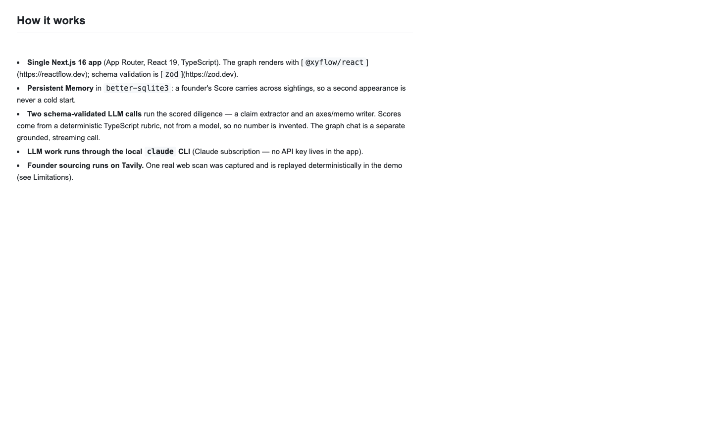
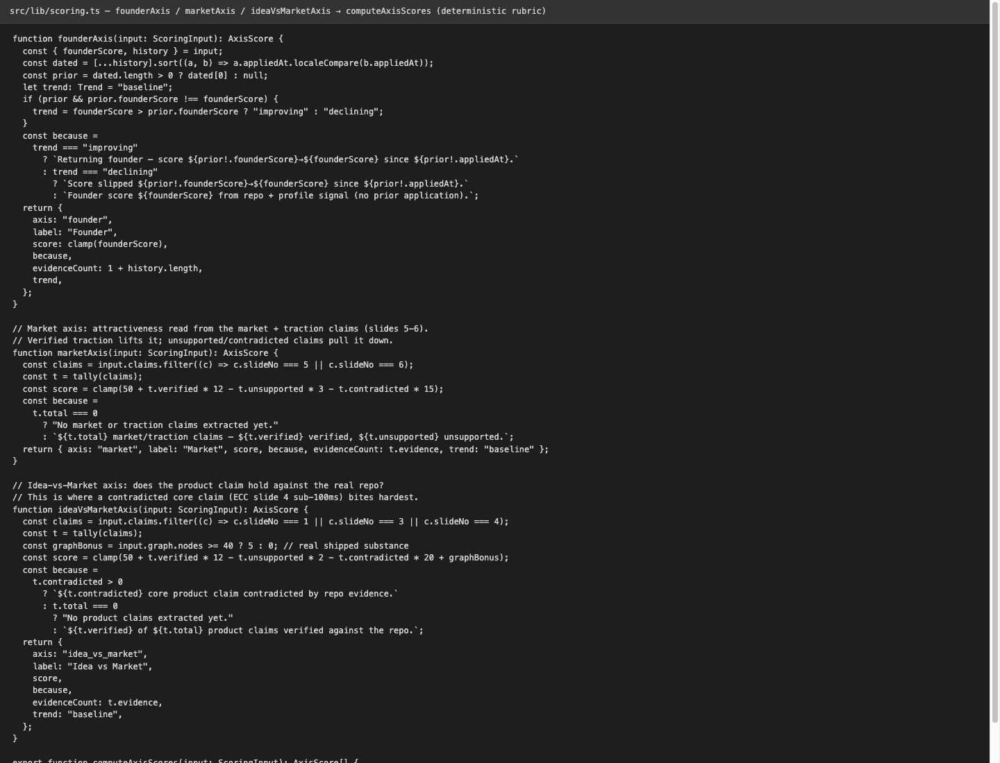
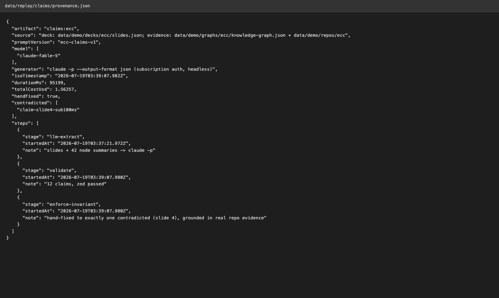
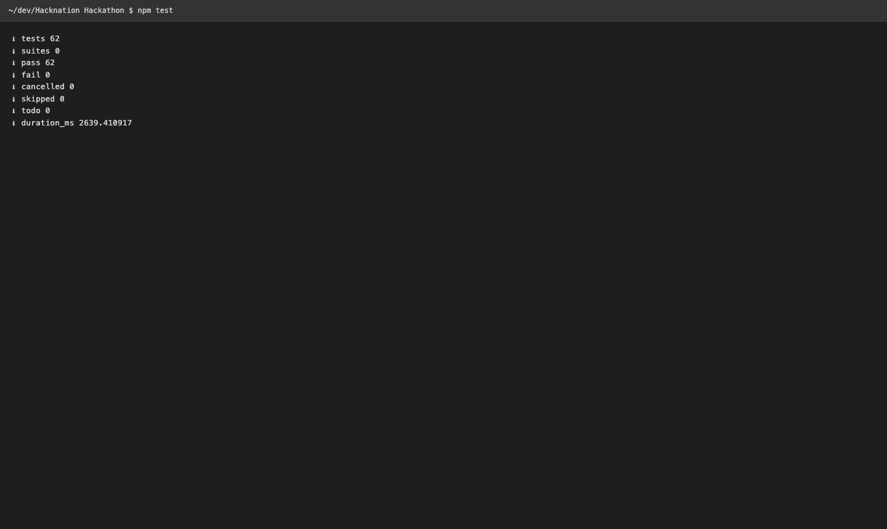
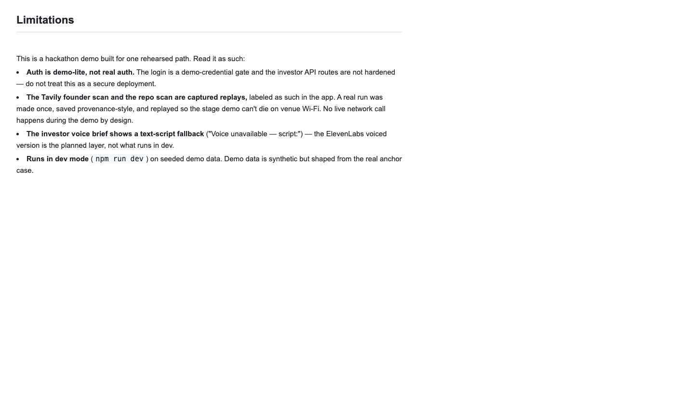

# VIDEO-SHOTLIST.md — shot cards for all three required videos

Adversarially verified against the code by two models (Fable 5 × GPT-5.6 Sol, 2026-07-19
11:45 BST) — every label, click, and timing below was checked against the actual components.
**Record one shot at a time** — a flub redoes that shot, never the take. Straight cuts.

## Before you record (do ALL of this once, in order)

1. **Reset the database** (seed alone does NOT clear saved decisions or test applications):
   ```sh
   node -e "const db=require('better-sqlite3')('data/vc-brain.db'); db.prepare('delete from decision').run();"
   npm run seed        # prints "Seeded 4 opportunities (3 visible)" — PipeWarden is now hidden
   ```
2. **Start the app on port 3941** (plain `npm run dev` uses port 3000):
   ```sh
   npm run dev -- -p 3941     # skip if http://localhost:3941/login already responds
   ```
   The floating Next.js dev button is already disabled in next.config.ts (`devIndicators: false`).
3. **Browser:** open http://localhost:3941 — you'll be redirected to `/login`. The
   credentials are prefilled (`investor@foundergraph.demo` / `demo`) — just click **Sign in**.
   Confirm the Pipeline board loads and PipeWarden is NOT on it.
4. **For Shot 7 only:** open the ECC card → scroll to DECISION → select **Invest** → Save.
   The saved-decision panel ("read back from the database") is what Shot 7 films.
   Do NOT re-run the reset after this.
5. Hide bookmarks bar, full-screen the browser, 1440×900 or larger.

---

# 1 · Demo video — max 60 seconds (hard cap)

Narration 124 words ≈ 50s at 150 wpm, leaving ~10s of air for clicks and holds.

## Continuous narration (read aloud once before recording)

> VCs spend **118 hours** of due diligence per deal — and only ten percent of deals come to
> them inbound. This is FounderGraph: founders scored from evidence, filtered by my thesis.
> This one is me — my real repo. One click: three separate scores — founder, market, idea
> versus market — and every deck claim tested against the code. Verified. Unsupported.
> Contradicted. The deck says sub-100ms routing. The repo's own docs undercut it — hooks add
> latency to every prompt. Exact slide, exact line. The repo is a living knowledge graph.
> I ask a question — the answer streams back with citations. Sourcing runs on Tavily — a
> real captured scan, replayed. And a new candidate appears: threshold crossed. Three axes,
> a cited memo, my decision on top. FounderGraph: $100K checks in 24 hours.

### Shot 1 · 0:00–0:08 · The problem


**Start state:** Pipeline board, 3 cards, no PipeWarden. **ACTION:** none — let it sit.
**SAY** (18w): "VCs spend **118 hours** of due diligence per deal — and only ten percent of deals come to them inbound."

### Shot 2 · 0:08–0:15 · The face (real anchor)

Same screen. The ECC card sits at the **top of the right-hand Inbound column** (Founder Score 82).

**ACTION:** move the cursor to the ECC card; circle the score + thesis chips.
**SAY** (18w): "This is FounderGraph: founders scored from evidence, filtered by my thesis. This one is me — my real repo."

### Shot 3 · 0:15–0:26 · One click into diligence


**ACTION:** click the ECC card. Scroll slowly: three axes → into the claims list.
**SAY** (21w): "One click: three separate scores — founder, market, idea versus market — and every deck claim tested against the code. Verified. Unsupported. Contradicted."

### Shot 4 · 0:26–0:36 · THE WOW — contradiction split view


**ACTION:** click the red **CONTRADICTED** claim ("sub-100ms agent routing"). Hold the modal 3 beats.
**SAY** (21w): "The deck says sub-100ms routing. The repo's own docs undercut it — hooks add latency to every prompt. Exact slide, exact line."
*(This wording matches exactly what the modal shows — quote, don't overclaim "disproved".)*

### Shot 5 · 0:36–0:44 · Graph + cited chat — RECORD AS A SEPARATE TAKE


**SET UP OFF CAMERA:** close the modal → scroll to the very bottom of Diligence (below the
DECISION section) → click **"Open graph explorer →"** → click **"Ask about this opportunity"**
→ **type the full question yourself**: `What does the routing layer actually do?` — the grey
text in the box is only a placeholder; clicking Ask on an empty box does nothing.
**ACTION on camera:** click **Ask**. First token may take 2–20s depending on whether a live
LLM key is configured — start the clip at the first token (trim dead time in the cut), keep
the ~2s stream, the CITATIONS block landing, and a short hold.
**SAY** (16w): "The repo is a living knowledge graph. I ask a question — the answer streams back with citations."

### Shot 6 · 0:44–0:53 · Scan reveal (sponsor beat)


**ACTION:** back to Pipeline → click **Tavily**, then **Scan**. The 8-row ladder reveals one
row every 120ms and the source buttons are DISABLED until it finishes — wait for all 8 rows
and the "Wrap · replaying captured Tavily run" callout. Then click **GitHub**, then **Scan**.
When the GitHub ladder completes, **scroll down the Outbound column** until the PipeWarden
card with its "threshold crossed" badge is visible; hold 2 beats.
**SAY** (15w): "Sourcing runs on Tavily — a real captured scan, replayed. And a new candidate appears: threshold crossed."

### Shot 7 · 0:53–0:60 · Close on the memo + decision


**ACTION:** open the ECC card again; scroll to the memo gaps + the saved DECISION panel
(saved in setup step 4). Freeze frame.
**SAY** (15w): "Three axes, a cited memo, my decision on top. FounderGraph: $100K checks in 24 hours."

---

# 2 · Tech video — max 60 seconds ("CTO giving a 1-minute investor update")

**Format (human ruling 2026-07-19 12:15 BST): professional slide deck** — open
[`docs/ops/tech-deck.html`](tech-deck.html) in the browser, press **F** for fullscreen,
advance with **→** (or click). **Slide N = Shot N** below; the deck contains real code
excerpts, the architecture diagram with the stack, and your SAY lines only as invisible
HTML comments — nothing you read appears on the recorded screen. Read your lines from this
file on a phone/printout. Narration 101 words ≈ 40s, leaving ~20s of air. The per-shot
"Screen:" file paths below remain as optional live b-roll if you prefer mixing in real
editor/terminal shots (Shot 5's live `npm test` is still the strongest on camera).

## Continuous narration

> One Next.js TypeScript app with SQLite Memory. Two captured, schema-validated LLM calls —
> Anthropic API — produce the diligence artifacts: claims and memo. Every score comes from a
> deterministic TypeScript rubric — no model invents a number. The hard part was epistemic
> honesty: chat that cites or refuses, and per-claim trust states grounded in my real
> repository. External calls are captured once for real — the Tavily scan, the LLM runs —
> and replayed deterministically with provenance. The demo can't die on venue Wi-Fi.
> Sixty-two automated tests and an offline golden-path smoke gate every beat. Limits:
> demo-only auth, a text-only voice-brief fallback, labeled replays. Everything else runs live.

### Shot 1 · 0:00–0:10 · Stack



**Screen:** `README.md` § "How it works" (VS Code preview Cmd-Shift-V, or GitHub once public).
**SAY** (21w): "One Next.js TypeScript app with SQLite Memory. Two captured, schema-validated LLM calls — Anthropic API — produce the diligence artifacts: claims and memo."

### Shot 2 · 0:10–0:18 · No invented numbers



**Screen:** `src/lib/scoring.ts` in your editor, `founderAxis` → `computeAxisScores` in view.
**ACTION:** cursor down the function once.
**SAY** (13w): "Every score comes from a deterministic TypeScript rubric — no model invents a number."

### Shot 3 · 0:18–0:30 · Epistemic honesty


**Screen:** the app — http://localhost:3941/opportunities/ecc claims list.
**ACTION:** hover a VERIFIED badge, then the CONTRADICTED one.
**SAY** (19w): "The hard part was epistemic honesty: chat that cites or refuses, and per-claim trust states grounded in my real repository."

### Shot 4 · 0:30–0:42 · Real captures, deterministic replay



**Screen:** `data/replay/claims/provenance.json` open in editor (model, totalCostUsd, timestamp visible).
**SAY** (24w): "External calls are captured once for real — the Tavily scan, the LLM runs — and replayed deterministically with provenance. The demo can't die on venue Wi-Fi."

### Shot 5 · 0:42–0:50 · Gates



**Screen:** terminal in the repo. **ACTION:** run `npm test` live — finishes in ~1.5s; hold on
the `ℹ pass 62` / `ℹ fail 0` lines.
**SAY** (11w): "Sixty-two automated tests and an offline golden-path smoke gate every beat."

### Shot 6 · 0:50–0:60 · Honest limits



**Screen:** `README.md` § "Limitations". **ACTION:** scroll once; freeze.
**SAY** (13w): "Limits: demo-only auth, a text-only voice-brief fallback, labeled replays. Everything else runs live."

---

# 3 · Team video — "explain who you are" (no official cap; ~28s as written)

Single talking-head webcam shot, one take, no screen share. 68 words ≈ 27s:

> Hi, I'm Supawich — a solo technical founder, and the whole team behind FounderGraph.
> The founder being diligenced in the demo is me: that's my real repository, my real deck
> claims, and one real contradiction the system caught in my own pitch. I'm exactly the kind
> of founder this tool is built to make visible — technical, no warm intro, all the evidence
> sitting in the code. Thanks for watching.
