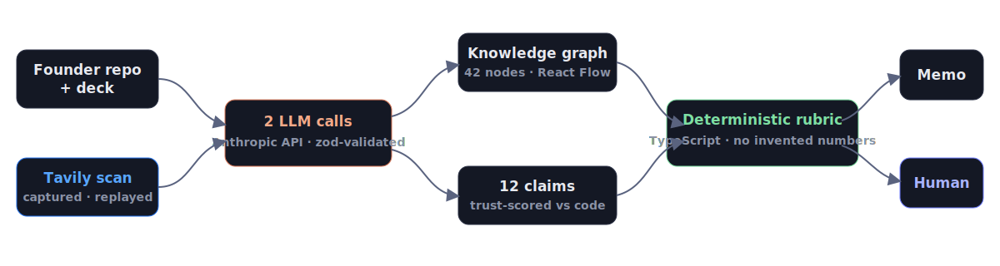

<!--
0:00–0:40 · HOOK + FACE — breathe, slow start.
"A VC spends ONE HUNDRED AND EIGHTEEN HOURS of due diligence on a single deal — and takes 83 days to close it. That's Harvard Business Review. [pause]
And a technical founder with no warm intro? Never even gets looked at.
I'm that founder. The repo you're about to see is my actual code.
FounderGraph is what an investor sees in minutes instead of weeks. Let me show you."
TRANSITION CUE → switch to the app (Pipeline board, hero card visible). Demo runs 0:40–1:50, then Slide 2.
-->

<span class="kicker">FounderGraph · Hack-Nation Challenge 02 · The VC Brain</span>

<span class="metric">118 hours</span>

<span class="statsub">of diligence per deal · 83 days to close — HBR</span>

<div class="sticky">The VC Brain that deploys $100K checks in 24 hours — every claim evidence-backed.</div>

---

<!--
1:50–2:30 · HOW IT WORKS + CLOSE — one breath, then slow.
"Under the hood: one Next.js app. Two schema-validated LLM calls — a claim extractor and a memo writer.
Every score comes from a deterministic TypeScript rubric, so no model invents a number.
Tavily sources the founders — one real scan, captured and replayed. ElevenLabs voices the brief.
[slow] That's the VC Brain that deploys $100K checks in 24 hours: sourcing, graph, three scores, memo — human decision on top.
[emphasis] 118 hours of diligence, down to one evidence-backed day. Thank you."
…and STOP TALKING. Hold this slide through Q&A start; flip to backup slides only if a question calls for one.
-->

# Evidence in. **Decision out.**



<div class="chips"><span>Next.js 16</span><span>TypeScript</span><span>SQLite Memory</span><span>Claude · Anthropic API</span><span>Tavily</span><span>ElevenLabs</span><span>62 tests · 13/13 offline smoke</span></div>

---

<!--
Q&A BACKDROP — flip here when scoring/evidence questions come.
One-line answers (full bank in PITCH-FINALS.md):
· Scores? Deterministic TypeScript rubric — no model invents a number; 2 schema-validated LLM calls only.
· Real or seeded? Both, honestly — one REAL Tavily scan captured, replayed on stage by design; no live network call.
· Different from PitchBook/Affinity? They index metadata; we read the founder's CODE and test the deck against it.
· Validated? I'm the real anchor — my own repo, 118h/83d pain from HBR.
· Adjacent scope? On the roadmap, one sentence, move on.
-->

<span class="backup">Q&A</span>

# Every score walks back to evidence.


---

<!--
BACKUP — "How are scores derived?" deep-dive.
"The rubric is code. The founder axis: sorted history, trend baseline/improving/declining, clamped score, a because-sentence citing the prior score. No model in this path."
-->

<span class="backup">BACKUP</span>

# No model invents a number.

```typescript
// src/lib/scoring.ts — the founder axis, deterministic
function founderAxis(input: ScoringInput): AxisScore {
  const { founderScore, history } = input;
  const dated = [...history].sort((a, b) => a.appliedAt.localeCompare(b.appliedAt));
  const prior = dated.length > 0 ? dated[0] : null;
  let trend: Trend = "baseline";
  if (prior && prior.founderScore !== founderScore) {
    trend = founderScore > prior.founderScore ? "improving" : "declining";
  }
  return { axis: "founder", score: clamp(founderScore), because, trend };
}
```

---

<!--
BACKUP — "Is the demo real?" / provenance question.
"External calls are captured once for real — the Tavily scan, the LLM runs — and replayed deterministically. provenance.json ships with every artifact: model, cost, timestamp. Every replay is labeled a replay; the demo can't die on venue Wi-Fi."
-->

<span class="backup">BACKUP</span>

# Captured once. Replayed deterministically.

<div class="chips"><span>model: claude-fable-5</span><span>totalCostUsd: 1.56</span><span>isoTimestamp: 2026-07-19T03:39Z</span><span>provenance.json ships with every artifact</span></div>

<div class="stat3">
<div><b style="color:#7ee0a3">62</b><span class="statsub">tests pass · node --test</span></div>
<div><b style="color:#6d7cff">13/13</b><span class="statsub">golden-path smoke · offline</span></div>
<div><b>0</b><span class="statsub">TypeScript errors</span></div>
</div>

---

<!--
BACKUP — limits / "what's stubbed?" question. Honesty wins ties.
"Auth is a demo gate, not production auth. The voice brief ships a text fallback — ElevenLabs rendering is the planned layer. Every replay is labeled a replay. Everything else runs live."
-->

<span class="backup">BACKUP</span>

# What it *isn't* — on purpose.

- Auth is a demo gate, not production auth.
- Voice brief ships a text fallback.
- Every replay is labeled a replay.

<div class="sticky">FounderGraph — the VC Brain that deploys $100K checks in 24 hours.</div>
